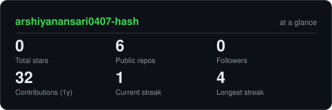
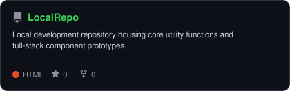

<div align="center">

<!-- PORTRAIT - generated by scripts/dotify.py from assets/jacket.png.
     Colour mode, so one file serves both GitHub themes. Regenerate with:
       python scripts/dotify.py assets/jacket.png -o assets/portrait \
         --cols 100 --equalize --detail 0.5 --color -->


<br>

<!-- NAME / TAGLINE - animated typing -->
<a href="https://github.com/arshiyanansari0407-hash">

  
</a>

<br>

<!-- SOCIALS -->
<a href="https://www.linkedin.com/in/arshiyan-ansari"></a>
<a href="arshiyanansari0407@gmail.com"></a>


</div>

---

## `~/` whoami

```console
$ cat about.txt
```

Hi, I'm Arshiyan Ansari. Full-Stack Developer & Software Engineering Intern specializing in the MERN stack and Python AI integration for web and mobile platforms.

- Role **Software Engineering Intern working on full-stack web & mobile app development**
- Currently building **AI-driven features using Python for 369innovation (Private Repo)**
- Learning **Advanced MERN Architecture + AI Model Integration**
- Fun fact: **I build real-world apps where full-stack web dev meets Python AI**

<br>

<div align="center">

## ~/ toolbox


</div>

---

<div align="center">

## `~/` skill radar

<table>
<tr>
<td width="50%" align="center" valign="middle">

<!-- Self-rated radar - edit assets/skills.json, the workflow redraws it -->
<picture>
  <source media="(prefers-color-scheme: dark)"  srcset="assets/radar-dark.svg">
  <source media="(prefers-color-scheme: light)" srcset="assets/radar-light.svg">
  
</picture>

</td>
<td width="50%" align="center" valign="middle">

<!-- Live radar built from real language byte counts across your repos -->
<picture>
  <source media="(prefers-color-scheme: dark)"  srcset="assets/radar-langs-dark.svg">
  <source media="(prefers-color-scheme: light)" srcset="assets/radar-langs-light.svg">
  
</picture>

</td>
</tr>
</table>

</div>

---

<div align="center">

## `~/` contribution calendar

<!-- 3D isometric calendar, regenerated every 6h by .github/workflows/metrics.yml -->


<br><br>

<!-- Snake eats the contribution graph - .github/workflows/snake.yml -->
<picture>
  <source media="(prefers-color-scheme: dark)"  srcset="https://raw.githubusercontent.com/gargibhardwaj24/gargibhardwaj24/output/snake-dark.svg">
  <source media="(prefers-color-scheme: light)" srcset="https://raw.githubusercontent.com/gargibhardwaj24/gargibhardwaj24/output/snake.svg">
  
</picture>

</div>

---

<div align="center">

## `~/` the numbers

<!-- Generated by scripts/cards.py into this repo. Deliberately NOT
     github-readme-stats / streak-stats / github-profile-trophy: those are
     shared public instances that go down and take the whole section with them. -->
<picture>
  <source media="(prefers-color-scheme: dark)"  srcset="assets/card-stats-dark.svg">
  <source media="(prefers-color-scheme: light)" srcset="assets/card-stats-light.svg">
  
</picture>

<br>


<br><br>
<!--

-->
</div>

---

<div align="center">

## `~/` selected work

<!-- Cards generated by scripts/cards.py from assets/projects.json.
     Stars, forks and language are pulled live from the API on every run. -->
<table>
<tr>
<td width="50%">
  <a href="https://github.com/arshiyanansari0407-hash/TradingBot">
    <picture>
      <source media="(prefers-color-scheme: dark)"  srcset="assets/card-TradingBot-dark.svg">
      <source media="(prefers-color-scheme: light)" srcset="assets/card-TradingBot-light.svg">
      
    </picture>
  </a>
</td>
<td width="50%">
  <a href="https://github.com/arshiyanansari0407-hash/LocalRepo">
    <picture>
      <source media="(prefers-color-scheme: dark)"  srcset="assets/card-LocalRepo-dark.svg">
      <source media="(prefers-color-scheme: light)" srcset="assets/card-LocalRepo-light.svg">
      
    </picture>
  </a>
</td>
</tr>
<tr>
<!--
<td width="50%">
  <a href="https://github.com/arshiyanansari0407-hash/Socrates">
    <picture>
      <source media="(prefers-color-scheme: dark)"  srcset="assets/card-Socrates-dark.svg">
      <source media="(prefers-color-scheme: light)" srcset="assets/card-Socrates-light.svg">
      
    </picture>
  </a>
</td>
<td width="50%">
  <a href="https://github.com/arshiyanansari0407-hash/humanOS">
    <picture>
      <source media="(prefers-color-scheme: dark)"  srcset="assets/card-humanOS-dark.svg">
      <source media="(prefers-color-scheme: light)" srcset="assets/card-humanOS-light.svg">
      
    </picture>
  </a>
</td>
</tr>-->
</table>
<!--
<sub>
<
| project | live | stack |
|---|---|---|
| **[TradingBot](https://github.com/arshiyanansari0407-hash/TradingBot)** | [dossier-iota-one.vercel.app](https://dossier-iota-one.vercel.app) | `Python` `AI` `Trading` |
| **[LocalRepo](https://github.com/arshiyanansari0407-hash/LocalRepo)** | [sage-calendar.vercel.app](https://sage-calendar.vercel.app) | `JavaScript` |
<
| **[Socrates](https://github.com/gargibhardwaj24/Socrates)** | [socrates-one-coral.vercel.app](https://socrates-one-coral.vercel.app) | `Next.js` `Prisma` `TypeScript` |
| **[humanOS](https://github.com/gargibhardwaj24/humanOS)** | [human-os-two.vercel.app](https://human-os-two.vercel.app) | `JavaScript` `Gemini` |
<
</sub>
-->
</div>

---

<div align="center">

<sub>`01110100 01101000 01100001 01101110 01101011 01110011 00100000 01100110 01101111 01110010 00100000 01110011 01100011 01110010 01101111 01101100 01101100 01101001 01101110 01100111`</sub>

</div>
